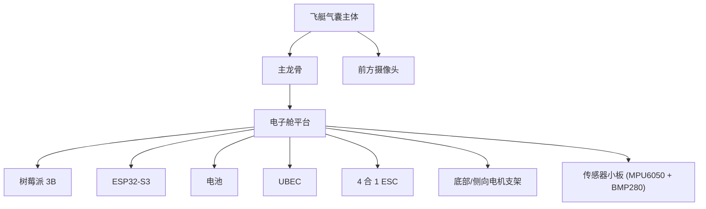
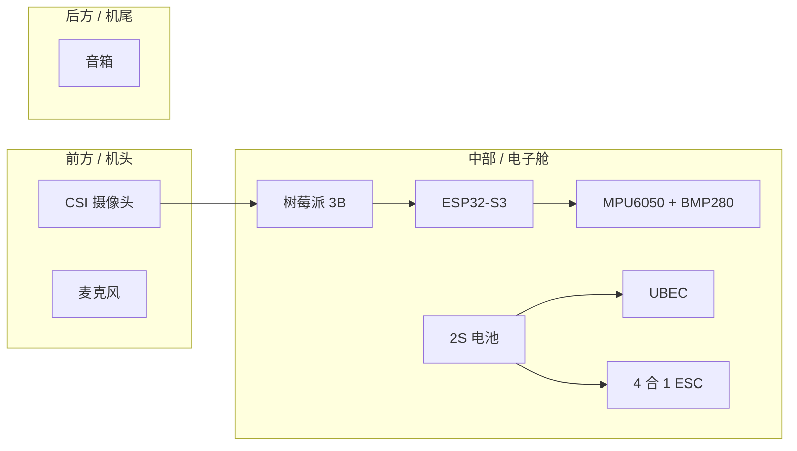
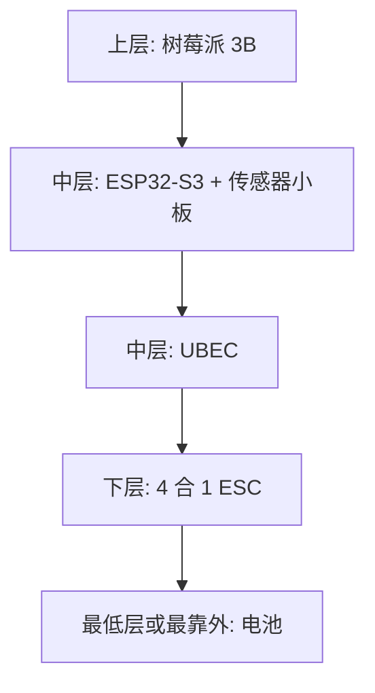
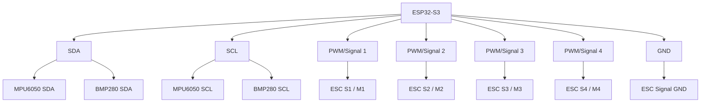
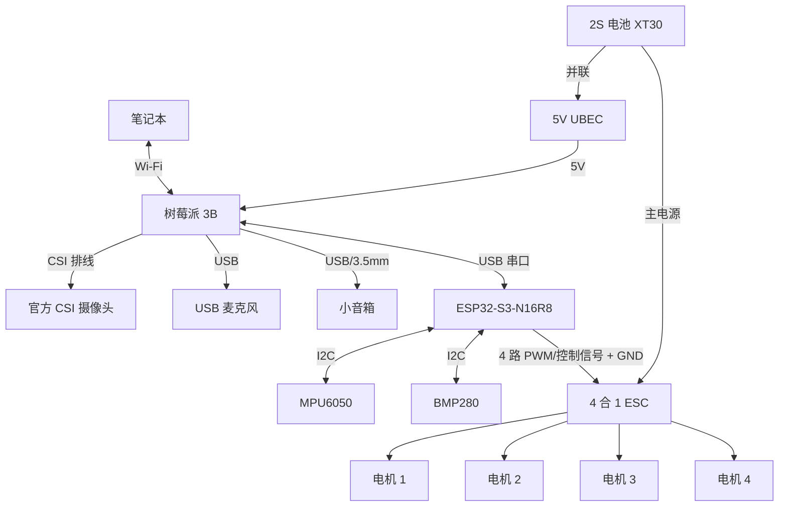

# AirPuff 安装与接线指南（详细版）

更新时间：`2026-03-20`

这份文档是给“硬件全部到货后，按步骤把 AirPuff 从零拼起来”用的。

目标不是只把东西接上，而是按正确顺序完成：
- 结构装配
- 低压逻辑联调
- 传感器接入
- 供电检查
- ESC / 电机联调
- 最后进入带桨地面测试和充氦配平

当前默认架构：
- 笔记本：大脑，负责视觉、语音、聊天、自主巡航
- 树莓派 3B：飞行端上位机，负责摄像头、麦克风、音箱、网络转发、串口下发
- ESP32-S3-N16R8：下位机，负责传感器、PWM / 电调输出、failsafe
- MPU6050 + BMP280：姿态与高度传感
- 4 合 1 ESC + 4 个无刷电机：执行层
- 2S 航模电池 + UBEC：整机供电

如果你时间紧，只看这几部分也够：
- `第 3 节` 推荐安装顺序
- `第 4 节` 安装图
- `第 6 节` 供电接线
- `第 8 节` ESP32 / 传感器 / ESC 接线
- `第 12 节` 到货后的实际执行顺序

注意：
- 当前软件已经验证的是“笔记本 -> 树莓派 -> ESP32”的软件链路。
- 真实硬件到手后，最先要调的是供电、接线、传感器、PWM 输出，不是先飞。
- 本文档尽量写成可直接照做的版本，但 4 合 1 ESC 焊盘命名、ESP32 丝印、具体电机支架形式可能会因卖家不同而略有差异，到手后按板子丝印优先。

## 1. 角色分工

### 树莓派要接什么
- CSI 摄像头
- USB 麦克风
- USB / 3.5mm 小音箱
- 到 ESP32 的 USB 串口线
- 到笔记本的 Wi-Fi

### ESP32 要接什么
- 通过 USB 接树莓派
- 通过 I2C 接 MPU6050 和 BMP280
- 通过 4 路控制信号接 4 合 1 ESC
- 和 ESC、传感器共地

### ESC / 电池 / UBEC 要接什么
- 电池 XT30 主电源直接进 ESC
- 同一电源入口并联给 UBEC
- UBEC 输出稳定 5V 给树莓派
- ESP32 第一阶段建议先由树莓派 USB 供电，不要一开始双路供电

## 2. 到货后先准备这些工具

- 电烙铁、焊锡、助焊剂
- 热缩管或电工胶布
- 万用表
- 扎带、双面胶、泡棉胶
- 小十字螺丝刀、剪钳
- 若干杜邦线或硅胶线
- 一根可靠的树莓派供电线
- 一根树莓派到 ESP32 的数据线

强烈建议：
- 第一次桌面联调时，螺旋桨不要装
- 第一次电机测试时，气球不要充氦、不上天
- 第一次供电测试时，只接低压逻辑部分，不接电机

## 2.1 到货开箱核对表

建议你到货后不要立刻焊，先把东西摆在桌上核对一遍。

### 结构件
- 飞艇气囊
- 碳纤维杆
- 双面胶 / 扎带 / 胶带
- 电机支架或横梁

### 计算与感知
- 树莓派 3B
- MicroSD 卡
- CSI 摄像头和排线
- USB 麦克风
- 小音箱
- 笔记本

### 执行与传感
- ESP32-S3-N16R8
- MPU6050
- BMP280
- 4 合 1 ESC
- 4 个无刷电机
- 螺旋桨两正两反

### 供电
- 2S 电池
- XT30 线
- UBEC
- 充电器

### 开箱后第一时间检查
- 每块板子有没有明显烧痕、虚焊、断针脚
- CSI 排线有没有折断
- ESC 有没有电容、焊盘和信号排针
- ESP32 能不能正常通过 USB 被识别
- MPU6050 / BMP280 模块丝印是否清晰
- 电池有没有鼓包

## 3. 推荐安装顺序

不要一口气全装上去。正确顺序是：

`机械结构 -> 低压逻辑 -> 传感器 -> 电源 -> ESC -> 电机 -> 桨叶`

### 阶段 A：先做艇体和龙骨
1. 给飞艇气囊充气到正常形态。
2. 在艇体底部用碳纤维杆做一条主龙骨。
3. 在主龙骨中部预留一块“电子舱平台”，用于固定树莓派、电池、UBEC、ESP32。
4. 让整个平台尽量靠近艇体几何中心，不要一开始就把所有重物装到头部或尾部。

完成标准：
- 气囊外形稳定，没有明显扭曲
- 主龙骨固定牢靠，不会左右晃
- 电子舱平台已经预留好，不需要后面临时补结构
- 手托主龙骨中部时，整体前后不会严重翘头或垂尾

### 阶段 B：先装低压设备
1. 安装树莓派 3B。
2. 安装 CSI 摄像头，镜头朝前。
3. 安装 USB 麦克风和音箱。
4. 安装 ESP32-S3，位置尽量靠近树莓派和传感器。
5. 安装 MPU6050、BMP280，尽量靠近艇体质心，且远离电机振动中心。

完成标准：
- 树莓派固定后，插拔线时不会带动整个平台变形
- 摄像头视野朝前，没有被气囊或横梁挡住
- 麦克风和音箱有一定距离，不是正对着贴脸
- ESP32 USB 口方便插线，不是被卡在死角里
- 传感器安装位置不会直接吃到电机振动

### 阶段 C：先把软件链路跑通
1. 树莓派装系统并联网。
2. 树莓派和笔记本互通。
3. 树莓派 USB 接 ESP32。
4. 给 ESP32 烧录当前执行层程序。
5. 跑 `esp32_serial_smoketest.py`。
6. 跑 `airpuff_system_debug.py`。

完成标准：
- 笔记本服务可访问
- 树莓派可识别 `/dev/ttyACM0`
- ESP32 能回 `ACK / STATE / EVENT`
- 树莓派与笔记本、ESP32 三端链路可用

### 阶段 D：最后装动力
1. 安装 4 合 1 ESC。
2. 安装 4 个电机支架与电机。
3. 接好电机到 ESC。
4. 最后确认转向后再装螺旋桨。

完成标准：
- ESC 固定牢靠，不会贴着气囊乱晃
- 电机到 ESC 的线长合理，不会绞进桨叶
- 4 路信号关系已经标记清楚
- 在不装桨的情况下已经验证过每个电机都能正常响应

## 3.1 推荐施工节奏

如果你是一个人装，比较稳的节奏是：

### 第一次施工
- 只做结构和设备摆位
- 不焊电机线
- 不接动力电

### 第二次施工
- 只做低压链路
- 跑通树莓派、ESP32、笔记本
- 确认摄像头、音频、串口都可用

### 第三次施工
- 再接传感器和供电
- 最后才接 ESC 和电机

这会比“一晚上全装完再一起点亮”安全得多。

## 4. 推荐空间布局

### 前后方向
- 摄像头朝前
- 音箱尽量不要正对麦克风
- 电池尽量靠近重心，方便前后配平

### 上下方向
- 气囊在上
- 龙骨和电子舱在下
- 电池在最靠近重心的位置

### 传感器放置原则
- MPU6050 与 BMP280 尽量固定在一个相对稳定的小板上
- 不要直接贴在电机座旁边
- 不要松垮悬空
- 尽量加一点泡棉减振，但不要软到会晃

## 4.1 安装图：侧视图

这张图主要看“上下层次”和“谁该在前、谁该在中、谁该在后”。



摆放理解：
- 气囊在最上面提供浮力
- 龙骨在中间承重
- 电子舱平台在下方挂载电子设备
- 摄像头朝前
- 电池尽量靠中间
- ESC 不要贴树莓派太近

## 4.2 安装图：俯视图

这张图主要看“前后左右位置关系”。



俯视布局原则：
- 摄像头放最前面，避免被结构件挡住
- 树莓派和 ESP32 放中部，便于走线
- 电池尽量靠中心线，方便配平
- 音箱往后一点，降低对麦克风的直接回灌

## 4.3 安装图：电子舱分层图

这张图主要看“电子舱里谁在上、谁在下”。



分层原则：
- 树莓派优先放在容易插卡、插排线、插 USB 的位置
- ESP32 靠近树莓派和 ESC，减少信号线长度
- ESC 靠近电机和动力电池，减少大电流线长度
- 电池放在最方便调重心的位置，不一定是最低，但一定要可前后微调

## 4.4 安装图：供电接线图

这张图是最关键的。


一定记住：
- 大电流主电优先走 `电池 -> ESC`
- 树莓派不要直接吃电池电压
- ESP32 第一阶段先从树莓派 USB 取电最省事

## 4.5 安装图：控制与传感接线图



## 4.6 建议的物理固定方式

### 树莓派
- 用轻量尼龙柱或泡棉双面胶固定
- 不建议裸板直接硬贴在碳纤维上
- 底部最好垫一层绝缘材料

### ESP32
- 用双面胶或小支架固定
- 保证 Type-C 口能插拔
- 不要把 USB 口顶着气囊

### 传感器小板
- 用小泡棉贴固定
- 固定后不要还能左右晃
- 尽量让板子方向和艇体坐标系一致

### 电池
- 用扎带加防滑垫固定
- 一定要能前后移动一点做配平
- 不要只用一小块双面胶硬粘

### ESC
- 用泡棉胶固定在通风、避震的位置
- 不要让焊点朝外暴露碰到金属件

## 5. 总接线拓扑



## 5.1 接线表：按设备拆开看

### 树莓派 3B

| 连接对象 | 接口 | 说明 |
| :--- | :--- | :--- |
| CSI 摄像头 | CSI 排线口 | 视频输入 |
| 麦克风 | USB | 音频输入 |
| 音箱 | USB 或 3.5mm | 音频输出 |
| ESP32-S3 | USB 数据线 | 串口通信 + 给 ESP32 供电 |
| UBEC | 电源输入 | 树莓派主供电 |

### ESP32-S3

| 连接对象 | 接口类型 | 说明 |
| :--- | :--- | :--- |
| 树莓派 | USB | 串口 + 供电 |
| MPU6050 | I2C | 姿态传感 |
| BMP280 | I2C | 高度传感 |
| ESC | 4 路控制信号 + GND | 控制 4 个电机 |

### 传感器

| 模块 | 电源 | 信号 |
| :--- | :--- | :--- |
| MPU6050 | 3.3V + GND | SDA + SCL |
| BMP280 | 3.3V + GND | SDA + SCL |

### ESC / 电机

| 设备 | 连接对象 | 说明 |
| :--- | :--- | :--- |
| ESC 主电输入 | 2S 电池 | 动力供电 |
| ESC 信号口 | ESP32 4 路 GPIO + GND | 控制输入 |
| 4 个电机 | ESC 三相输出 | 动力输出 |

## 6. 供电接线

这是最重要的一部分。只要供电接错，软件再稳也没用。

### 正确的电源主链路
- `2S 电池 XT30` -> `4 合 1 ESC 主电源输入`
- 从 ESC 主电源入口并联一组线 -> `UBEC 输入`
- `UBEC 5V 输出` -> `树莓派 3B 电源输入`

推荐理解方式：
- ESC 吃的是“粗暴动力电”
- 树莓派吃的是“UBEC 稳压后的 5V 逻辑电”
- ESP32 第一阶段吃的是“树莓派 USB 给的 5V”

### 树莓派供电建议
最稳妥的做法：
- 用 UBEC 输出的稳定 5V 通过树莓派的电源输入口供电

不建议一开始就这么干：
- 直接把电池接树莓派
- 直接把未经确认的 ESC BEC 接树莓派
- 一上来就从 GPIO 5V 针脚硬灌电

### ESP32 供电建议
第一阶段建议：
- ESP32 通过“树莓派 -> USB 数据线”供电和通信

这样做的好处：
- 结构简单
- 少一条电源支路
- 便于确认 `/dev/ttyACM0`

第一阶段不建议：
- 同时让 ESP32 吃树莓派 USB 供电和外部 5V 供电

### 为什么不建议一开始给 ESP32 双供电
- 很多开发板的 5V 管理并不是为“双路灌电”设计的
- 轻则串口不稳定
- 重则板子发热、掉口、异常复位

### 第一次供电建议顺序
1. 不接电池，只让树莓派单独上电。
2. 验证树莓派、ESP32、笔记本链路正常。
3. 接 UBEC，但先不接 ESC。
4. 用万用表量 UBEC 输出是不是稳定 5V。
5. 最后再把电池接到 ESC 主电。

### 供电测试时一定要做的事
- 万用表先测再插树莓派
- 先断开螺旋桨
- 第一次动力上电时，手不要放在桨盘范围内
- ESC 上电时如果有异常发热、异味、冒烟，立刻断电

### 共地原则
必须保证这些地线是通的：
- ESP32 GND
- ESC Signal GND
- MPU6050 GND
- BMP280 GND

一句话：
- 动力电和逻辑电可以分支
- 但控制信号参考地必须共地

## 7. 树莓派接线

### 7.1 摄像头
- 使用官方 CSI 摄像头 V2
- 用排线接树莓派 CSI 接口
- 镜头朝前
- 排线蓝面 / 金手指方向以树莓派接口丝印为准

常见坑：
- 排线反插
- 排线没插到底
- 把 CSI 摄像头错买成 USB 摄像头

安装建议：
- 摄像头尽量固定在艇头偏下位置
- 视野略微向前下方一点点，方便看障碍和地面
- 别把镜头装得正贴在气囊曲面后面，否则会被边缘遮挡

### 7.2 麦克风与音箱
- 麦克风插树莓派 USB
- 音箱按设备类型接 USB 或 3.5mm
- 演示时尽量把音箱和麦克风分开安装，避免啸叫

安装建议：
- 麦克风尽量朝外，不要贴着音箱
- 音箱尽量朝侧后方
- 如果后面发现啸叫，先从“拉开距离”和“降低音量”调，不要先怀疑软件

### 7.3 树莓派到 ESP32
- 用一根数据线把树莓派和 ESP32 直连
- 这根线同时承担：
  - 串口通信
  - 给 ESP32 供电

当前软件默认识别目标是：
- `/dev/ttyACM0`

如果 ESP32 板子上有两个 Type-C：
- 优先使用那个接上后会在树莓派里出现 `/dev/ttyACM0` 的口
- 另一口如果是下载口或辅助口，先不要混用

实际操作建议：
- 第一次插线后在树莓派执行 `ls /dev/ttyACM*`
- 如果没有，再执行 `dmesg | tail`
- 确认是“能稳定识别”的那一个 Type-C 口之后，再固定走线

## 8. ESP32 接线

### 8.1 I2C 传感器
MPU6050 和 BMP280 都接到 ESP32 的同一组 I2C 总线上。

连接原则：
- `SDA` -> ESP32 的 I2C SDA
- `SCL` -> ESP32 的 I2C SCL
- `VCC` -> ESP32 `3V3`
- `GND` -> ESP32 `GND`

两块传感器是并联在同一总线上的：
- ESP32 SDA 同时到 MPU6050 SDA、BMP280 SDA
- ESP32 SCL 同时到 MPU6050 SCL、BMP280 SCL

供电建议：
- 传感器先统一走 `3.3V`
- 即使模块上写着支持 5V，第一阶段也优先 3.3V，避免电平问题

安装建议：
- MPU6050 和 BMP280 可以先绑在同一块小泡棉板或小亚克力板上
- 这块小板再固定到 ESP32 附近
- 线不要太长，也不要绷太紧

实物接线时建议你给线贴标签：
- `SDA`
- `SCL`
- `3V3`
- `GND`

### 8.2 到 ESC 的 4 路控制信号
当前软件里的执行通道命名是：
- `front_left`
- `front_right`
- `rear_left`
- `rear_right`

建议你硬件上也按这个命名接，后面调试最省事。

推荐逻辑映射：

| 软件通道 | ESC 通道 | 对应电机位置 |
| :--- | :--- | :--- |
| `front_left` | `S1 / M1` | 前左 |
| `front_right` | `S2 / M2` | 前右 |
| `rear_left` | `S3 / M3` | 后左 |
| `rear_right` | `S4 / M4` | 后右 |

接线原则：
- ESP32 4 路 PWM / 控制 GPIO -> ESC 的 `S1 / S2 / S3 / S4`
- ESP32 `GND` -> ESC 的信号地

注意：
- 现在代码里这 4 路 GPIO 还没有写死，仍是占位态
- 硬件到手后，我们会按你板子的真实丝印把 GPIO 填进 [esp32_exec_mpy.py](/Users/walter/Desktop/SETM下/机器人/esp32_exec_mpy.py)
- 所以现阶段接线时，先保证“通道关系”对，GPIO 编号到时再定

推荐施工方式：
1. 先在 ESC 边上贴标签 `M1 / M2 / M3 / M4`
2. 再在电机支架边上贴标签 `前左 / 前右 / 后左 / 后右`
3. 最后再把软件通道 `front_left / front_right / rear_left / rear_right` 对上去

这样后面你就不会在“电机实际位置”和“软件通道名字”之间搞混。

### 8.3 ESP32 当前软件状态
当前 [esp32_exec_mpy.py](/Users/walter/Desktop/SETM下/机器人/esp32_exec_mpy.py) 的特点：
- 串口协议已通
- 状态机已通
- 混控已通
- 输出默认关闭，安全

也就是说：
- 现在它适合做桌面联调
- 真接电调前，还要把对应 GPIO、PWM 参数补进去

### 8.4 传感器和 ESC 最后要确认的点
- MPU6050 安装方向是不是和机头方向一致
- BMP280 有没有被气流直接吹到
- ESC 信号地有没有接
- ESC 的 4 路输入到底标的是 `S1-S4` 还是 `M1-M4`
- ESP32 的控制 GPIO 有没有选到启动相关敏感脚

## 9. 电机与桨叶安装

### 电机安装顺序
1. 先把 4 个电机固定到支架。
2. 再把支架固定到龙骨或横梁。
3. 电机三相线接到 ESC。
4. 通电测试转向。
5. 最后才装螺旋桨。

### 非常重要
- 无刷电机三相线不分正负
- 如果电机转向不对，交换任意两根三相线即可反转
- 第一次调试时，绝对不要带桨测

### 螺旋桨
- 用两正两反
- 安装前先确认每个电机最终旋向
- 最终旋向和推进布局，要等我们真实看你的电机安装方向后再最后确认

### 电机线怎么收纳
- 电机三相线尽量沿支架边缘走
- 不要垂下来甩进桨盘
- 多余线长用扎带固定
- 不要把大电流线压在 CSI 排线和传感器细线上

## 9.1 无桨调试流程

第一次电机联调请严格按这个顺序：

1. 不装桨。
2. 只接 ESC 主电和信号。
3. 让 ESP32 只输出很小的测试量。
4. 看 4 个电机是否都能转。
5. 逐个确认哪个电机对应哪个通道。
6. 确认转向。
7. 确认停止命令和 failsafe 有效。
8. 全部确认后再装桨。

## 9.2 装桨前最后确认

- 每个电机位置已经贴标签
- 每个电机的旋向已经记录
- 两正两反桨已经分清
- 桨不会打到龙骨、线材、气囊
- `STOP` 命令时四路都能稳定停下

## 10. 推荐装配顺序清单

### 第 1 天：只做低压逻辑联调
- 树莓派装系统
- 接 CSI 摄像头
- 接麦克风和音箱
- 树莓派连笔记本
- 树莓派 USB 接 ESP32
- 烧录 ESP32
- 跑串口与链路测试

### 第 2 天：加传感器
- 接 MPU6050
- 接 BMP280
- 确认 I2C 能识别
- 确认传感器安装方向

### 第 3 天：加供电系统但不接电机
- 接电池
- 接 ESC 主电
- 接 UBEC
- 空载测 UBEC 输出是不是稳定 5V
- 只给树莓派供电

重点：
- 这一天的目标不是转电机
- 只是确保“供电对、没冒烟、树莓派和 ESP32 还活着”

### 第 4 天：接 ESC 信号和电机，但不装桨
- ESP32 接 4 路 ESC 控制信号
- 接电机
- 做最小油门 / 中位 / 停止测试
- 确认 4 路输出对应关系

### 第 5 天：装桨并做地面限幅测试
- 装桨
- 先限制推力输出
- 验证前进、转向、上升、停止四类动作
- 最后再做充氦后的配平和悬停调试

建议：
- 第一次地面带桨测试时，两个人一起做最好
- 一个人扶结构，一个人盯终端和断电

## 11. 上电前检查表

每次上电前都快速看一遍：

- 电池正负极确认无误
- UBEC 输出确认是 5V，不是 7.4V
- 树莓派没有被直接接到电池
- ESP32 没有双路 5V 同时供电
- ESC 信号线和地线都接了
- 传感器走的是 3.3V
- 螺旋桨在桌面调试时已拆下
- 树莓派能识别到 ESP32 串口

## 11.1 实飞前检查表

真的准备带气囊上电、上推力前，再看一次：

- 气囊浮力足够，结构不会明显下坠
- 重心基本在艇体中部
- 电池固定牢靠
- 摄像头视野无遮挡
- 麦克风和音箱没有严重啸叫
- 4 个电机方向都已确认
- 螺旋桨没有装反
- 树莓派、ESP32、笔记本三端通信正常
- `STOP` 和 failsafe 已实际验证过
- 身边没有人站在桨盘面附近

## 11.2 配平建议

第一次充氦后的目标不是立刻飞，而是先配平。

配平方法：
1. 先不启动力，只看自然姿态。
2. 如果艇头明显下沉，电池往后移一点。
3. 如果艇尾明显下沉，电池往前移一点。
4. 如果左重右轻，就横向微调电子舱或加轻量配重。
5. 调到“基本水平，微微头前”就可以。

## 12. 到货后第一轮联调命令

### 笔记本
```bash
chmod +x ~/laptop_start_airpuff_server.sh
~/laptop_start_airpuff_server.sh full ~/airpuff_server.py
```

### 树莓派
```bash
~/pi_flash_esp32_mpy.sh /dev/ttyACM0
~/pi_upload_esp32_mpy.sh /dev/ttyACM0 ~/esp32_exec_mpy.py
python3 ~/esp32_serial_smoketest.py --port /dev/ttyACM0 --action FORWARD
python3 ~/airpuff_system_debug.py --server http://192.168.31.240:5000/api/sense --serial /dev/ttyACM0
```

如果只是先查环境：
```bash
ITERS=30 ~/pi_airpuff_stack_check.sh http://192.168.31.240:5000/api/sense /dev/ttyACM0
```

## 12.1 到货后建议的实际执行顺序

建议你真到货后按这个顺序来，不容易乱：

1. 树莓派单独上电。
2. 摄像头、麦克风、音箱接上。
3. 树莓派和笔记本联网。
4. ESP32 通过 USB 接树莓派。
5. 烧录并跑通串口冒烟。
6. 接上传感器。
7. 接 UBEC，但不接 ESC 主电。
8. 万用表确认 5V 正常。
9. 接 ESC 信号线。
10. 接电机，但不装桨。
11. 最后才接电池主电和桨。

## 13. 现在还不能写死的项目

这些要等实物到手后最后确认：
- 4 合 1 ESC 焊盘标签是不是 `S1 / S2 / S3 / S4`
- ESC 控制协议最终用标准 PWM 还是更高速协议
- ESP32 具体选哪 4 个 GPIO 出控制信号
- MPU6050 和 BMP280 的实际安装朝向
- 电机支架位置和推力方向
- 最终螺旋桨旋向

这不影响你先拼装：
- 先把平台、供电、摄像头、树莓派、ESP32、传感器位置装好
- 控制 GPIO 和电机旋向属于“到货后最后一层参数化”

## 14. 最容易踩的坑

- 用 USB 摄像头代替 CSI 摄像头
- 电池直接喂树莓派
- 忘了共地
- 传感器上 5V
- 电机还没确认转向就先装桨
- ESC 信号口顺序和软件通道顺序对不上
- 把传感器固定在高振动位置
- 给 ESP32 同时喂两路 5V
- 电池没有留可滑动位置，后面配平很难调
- 大电流线和摄像头排线、I2C 细线缠在一起

## 14.1 出问题时先查哪里

### 树莓派看不到 ESP32
- 换另一根数据线
- 换 ESP32 的另一个 Type-C 口
- 看 `dmesg | tail`
- 看 `ls /dev/ttyACM*`

### 传感器读不到
- 先看 `3.3V` 和 `GND` 有没有接对
- 再看 `SDA / SCL` 有没有反
- 再看模块是不是焊点虚焊

### 树莓派反复重启
- 十有八九先查供电
- 先查 UBEC 输出
- 再查电池电压是否掉太快

### 电机乱转或不按预期
- 先确认信号通道顺序
- 再确认电机旋向
- 再确认软件通道映射

### 一上电就很吵、很乱
- 先断桨
- 回到“无桨测试流程”
- 不要带桨硬顶着调

## 15. 一句话总结

装配顺序记住这句就够了：

`先装结构，再装低压逻辑，再装传感器，再测供电，最后才接 ESC、电机和桨。`

等硬件到了以后，我们就直接按这份文档一项一项对着做，然后把“GPIO 编号、ESC 通道、旋向和 PID / 混控参数”补齐。
